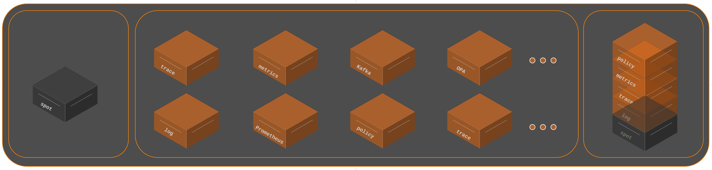

#  Spot

This project is a base block for building layers.

---

## :trophy: Advantages of Using Spot

- **Maintenance**: Spot simplifies maintenance, eliminating the need to alter each application individually. You don't need to rewrite features for each programming language.

- **Observability**: Instrumentation for collecting metrics and logs, enabling better understanding of performance and behavior of different parts of the system.

- **Security**: Specific security policies can be implemented for each functionality in a more granular way, allowing for custom security for each part of the system.

- **Flexibility**: Spot can be combined and customized in various ways to meet the specific needs of the application, providing greater flexibility in application design and architecture.

- **Testability**: Spot can be tested individually, making it easier to identify and resolve issues before integration into the application.

###  :notebook_with_decorative_cover: Documentation

:link: [developers](./spot/docs/en-us/docs.md)